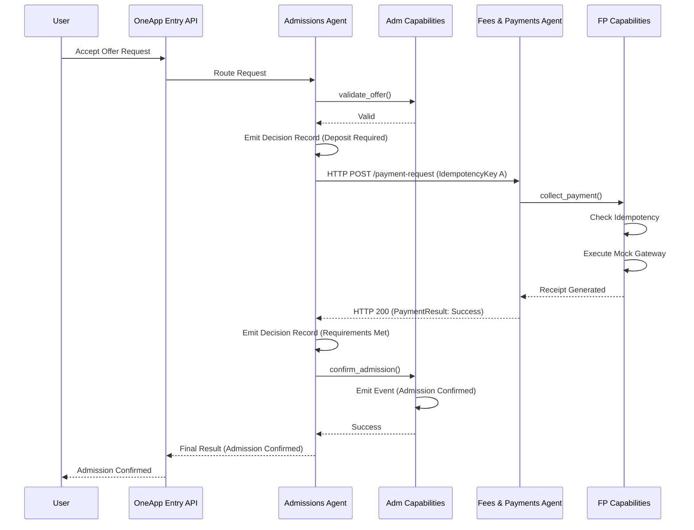

# Phase 3: POC Technical Architecture

**Status:** Draft

## 1. Architecture Principles
1. **Business Ownership Precedence:** Technical architecture must not bypass or alter the canonical business domain boundaries.
2. **Decision vs. Action Separation:** Agents evaluate state and intent (Decision) and invoke deterministic operations (Action). They do not manipulate data directly.
3. **No Hidden Chain-of-Thought:** Model internals are not authoritative. Agents must emit Structured Decision Records.
4. **Deterministic Mutability:** State changes are the exclusive responsibility of deterministic capabilities.

## 2. System Context
The POC represents a single vertical slice: a student accepting an admission offer and completing a mandatory deposit. 
* Primary actor: Student
* Domains: Admissions, Fees & Payments
* Excluded: Student Lifecycle (receives the student post-confirmation), Finance (downstream ledger reconciliation).

## 3. Logical Components & Runtime Topology
The POC consists of the following minimal runtime components:
* **OneApp Entry API:** Receives user request, establishes initial context, routes to the Admissions Agent, and returns the final result. It is **NOT** a business orchestrator (it does not decide business steps, coordinate domains, retry payments, or confirm admission).
* **Admissions Domain Container:**
  * Admissions Agent Runtime
  * Admissions Deterministic Capabilities (Offer Validation, Configuration)
  * Admissions State Store (SQLite)
* **Fees & Payments Domain Container:**
  * Fees & Payments Agent Runtime
  * Fees & Payments Deterministic Capabilities (Obligation Creation, Mocked Gateway, Receipting)
  * Fees & Payments State Store (SQLite)
* **Observability Bus (Mock):** A simple log aggregator for Structured Decision Records and Business Events.

## 4. Agent Runtime Model
A lightweight, custom Python execution loop wrapping the LLM API. 
* **Input:** Receives a structured context payload.
* **Evaluation:** Prompts the LLM with business rules and current state.
* **Invocation:** Uses explicit tool-calling definitions to execute capabilities.
* **Termination:** Returns a final structured outcome.

## 5. Orchestration Model
**Admissions-Agent-Led Orchestration / Delegation**.
Admissions owns the progression of the admission confirmation workflow. It delegates the payment collection step to Fees & Payments via REST and waits for the result to continue its logic. There is no central BPMN engine driving the business logic, nor is this purely event-driven choreography.

## 6. Agent Communication & Discovery
* **Protocol:** Synchronous HTTP/REST.
* **Discovery:** Static Configuration (Environment Variables pointing to localhost ports).

## 7. Contract Transport
* **Format:** JSON payloads over HTTP POST.
* **Validation:** Strict schema validation via Pydantic at the receiving boundary.
* **Schemas:** `StudentPaymentRequest`, `StudentPaymentResult`.

## 8. Identity & Authorization
* **Agent Identity:** Passed in the HTTP Headers/Payload (`RequestingAgent`, `RequestingDomain`).
* **Capability Identity:** Hardcoded tool access matrices in the Agent Runtime.
* **Security Boundary:** For the POC, domains implicitly trust requests that pass schema validation and originate from configured internal domain identities. Production IAM is deferred.

## 9. Capability Invocation
Agents invoke capabilities via LLM Tool Calling. The tool executes a local Python function which performs:
1. Input validation.
2. Idempotency checks.
3. Database mutation (authoritative state).
4. Emitting a Business Event.
5. Returning the result to the Agent.

## 10. State Ownership
* **Admissions Store:** Owns `Offer` and `AdmissionStatus`.
* **Fees & Payments Store:** Owns `FinancialObligation`, `Receipt`, and the `IdempotencyKey` record for the transaction.
Agents cannot query or write to each other's stores.

## 11. Structured Decision Records
Stored as structured JSON logs written to standard output, captured by a mock observability logger. They contain `DecisionID`, `CorrelationID`, `DecisionOutcome`, `ApplicableRules`, and `AuthorizedAction`.

## 12. Business Events
Represent canonical state transitions (e.g., `Admission Confirmed`, `Payment Confirmed`). Emitted as JSON logs by the deterministic capabilities after successful database commits. Distinct from HTTP 200 technical responses. 
**Crucial Distinction:** Business events are for observation/audit, NOT workflow orchestration. The event log does not determine the next step in the POC workflow; the synchronous REST response serves as the workflow control signal.

## 13. Failure & Retry Model
* **Business Failure** (Payment Declined): Admissions agent evaluates and halts confirmation.
* **Validation Failure** (Malformed Request): Fees & Payments rejects immediately. No automatic retry.
* **Transient Technical Failure** (Timeout): Admissions agent may retry sending the *same* request.
* **Permanent Technical Failure**: Execution halts; escalates to user/admin.

## 14. Idempotency
Enforced by the **Fees & Payments** domain. When receiving a `StudentPaymentRequest`, it checks the `IdempotencyKey` against its local store. 
* **Rule:** One Idempotency Key = One Logical State-Mutating Operation. 
* If a duplicate key is found, it returns the existing `StudentPaymentResult` without charging again.

## 15. Traceability
Execution can be reconstructed via logs by chaining identifiers:
`User Request ID` -> `Correlation ID` (Workflow trace) -> `Structured Decision Record` -> `Idempotency Key` -> `Business Transaction ID` (Receipt) -> `Business Event`.

## 16. Technology Selection
* **Language:** Python
* **Web Framework:** FastAPI (for Agent-to-Agent REST contracts)
* **Validation:** Pydantic
* **State:** SQLite (local isolated files)
* **LLM Integration:** Direct API SDK with native tool calling.

## 17. Architecture Diagrams

### A. End-to-End Sequence

## 18. Implementation Boundary
This architecture is frozen for Phase 3. No code, databases, or orchestrators have been built yet. Phase 4 will implement this exact specification.
