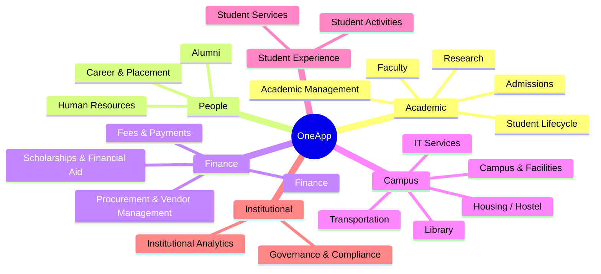
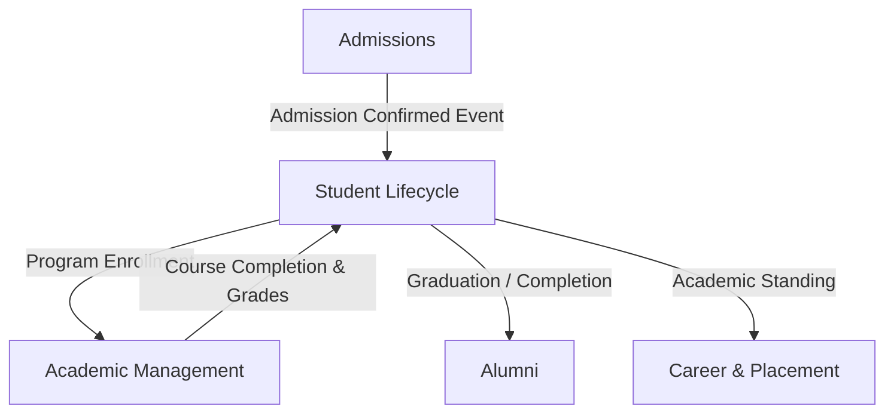
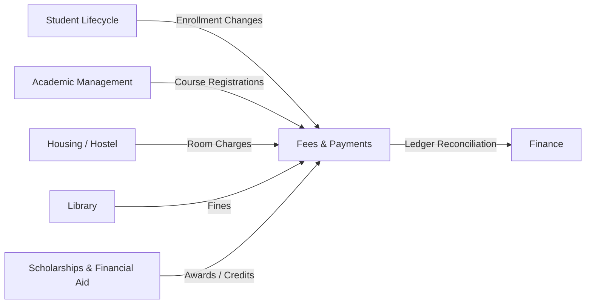
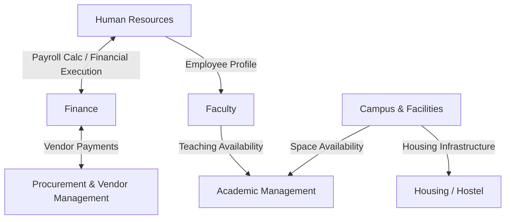
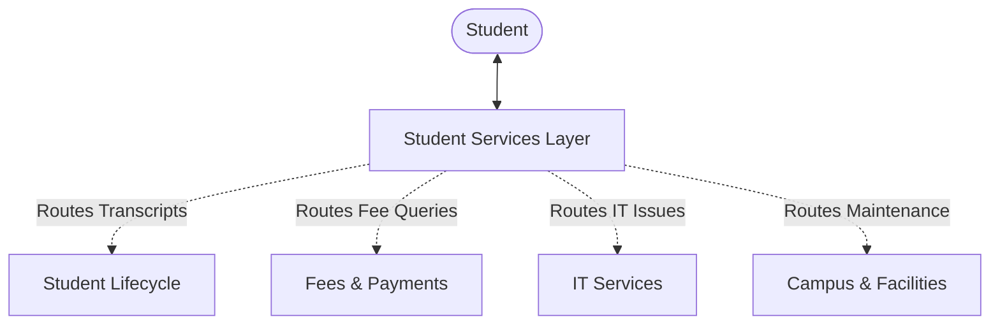

# Business Domain Context Map

**Version:** 1.0  
**Status:** Pending Review  

This document visually represents the logical grouping of business domains and the key relationships and information flows between them.

## Domain Categorization

## Key Cross-Domain Relationships

### 1. The Student Academic Journey
This represents the canonical flow of a student through the primary academic domains.

### 2. The Student Financial Lifecycle
This highlights how student financial obligations interact with academic and funding domains.

### 3. The Institutional Resource Flow
This demonstrates how HR, Finance, and Faculty domains interact regarding staff and resources.

### 4. The Student Service Layer
This highlights the role of Student Services as an orchestration and routing layer.

## Platform Layer Dependency
All domains implicitly rely on the Cross-Cutting Platform Capabilities (Identity, Workflow, Policy, Documents, Notifications, Search, Audit, Agent Orchestration). They are not shown as domains above to maintain architectural clarity.
